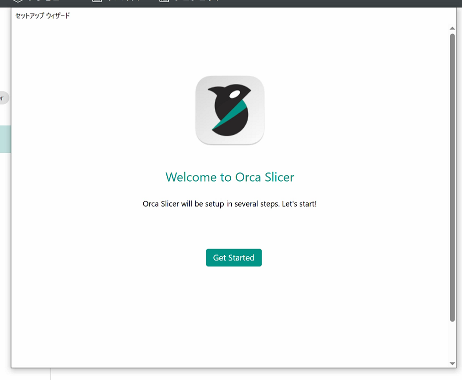
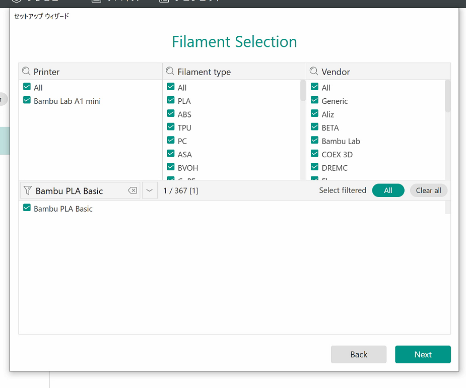
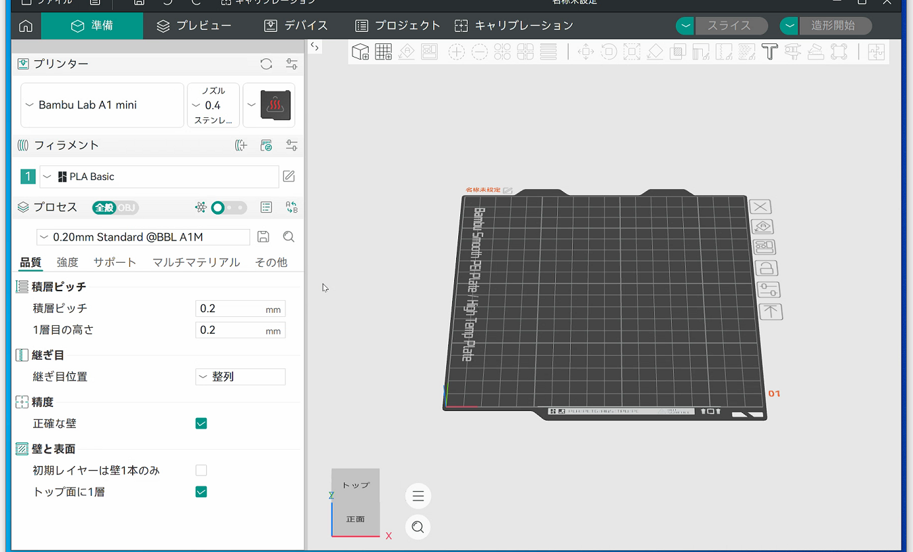
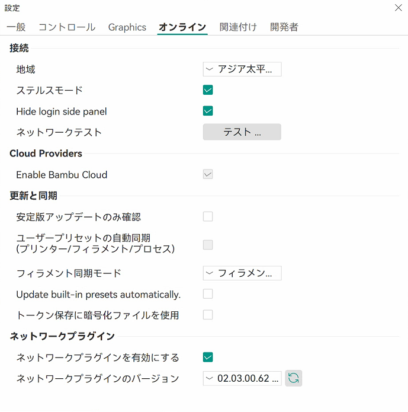
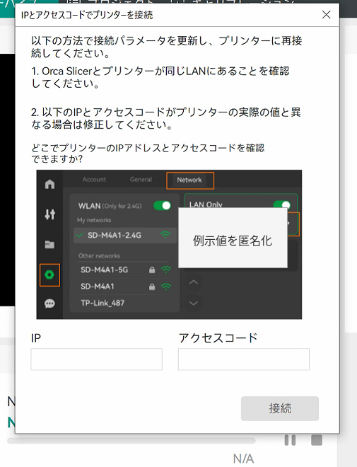
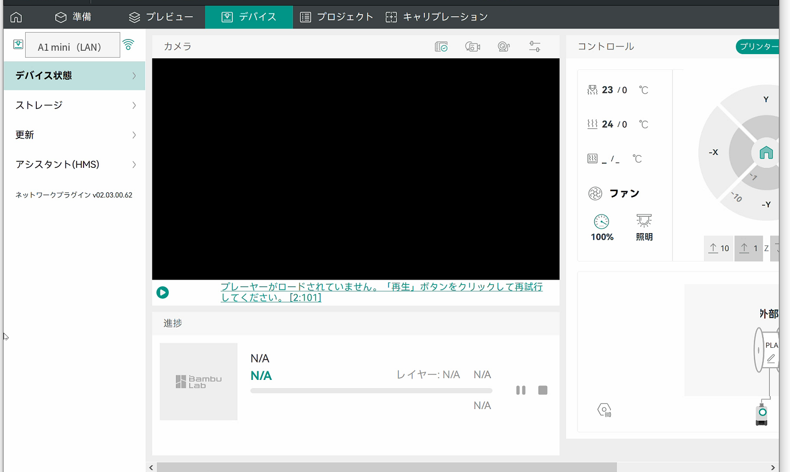
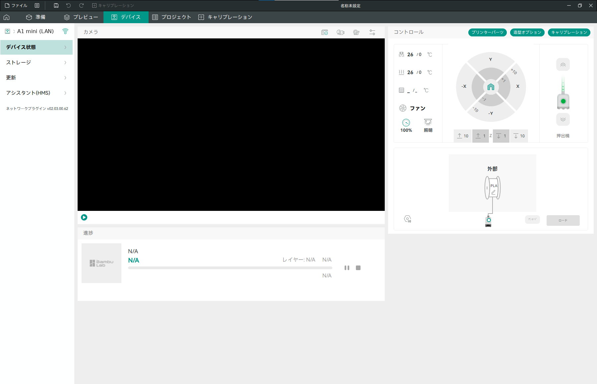
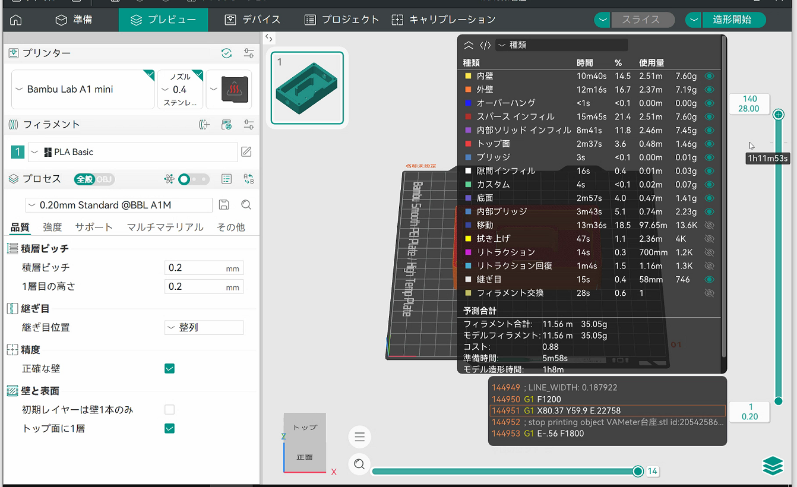
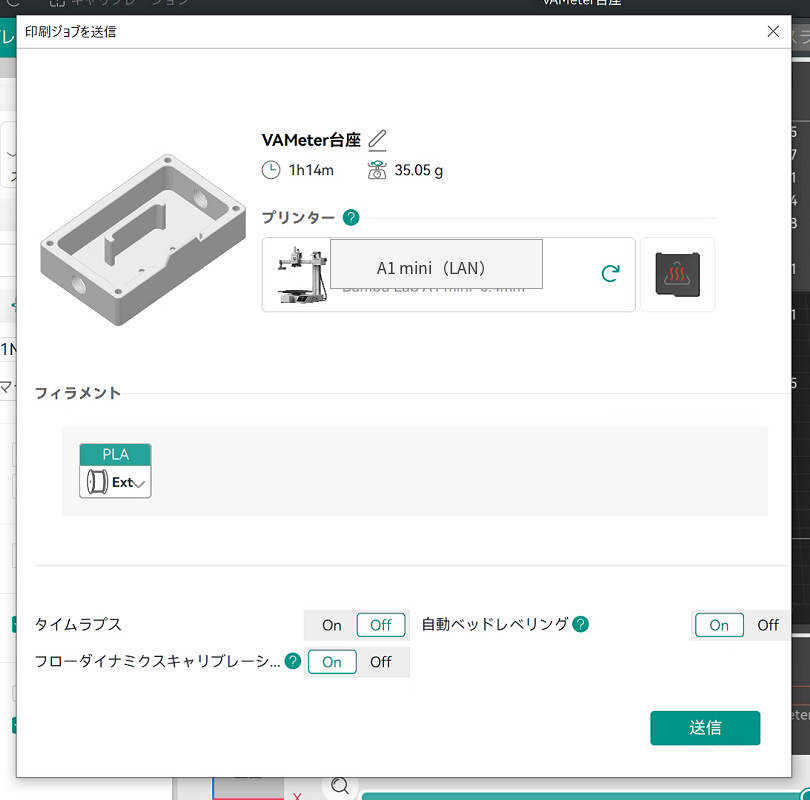
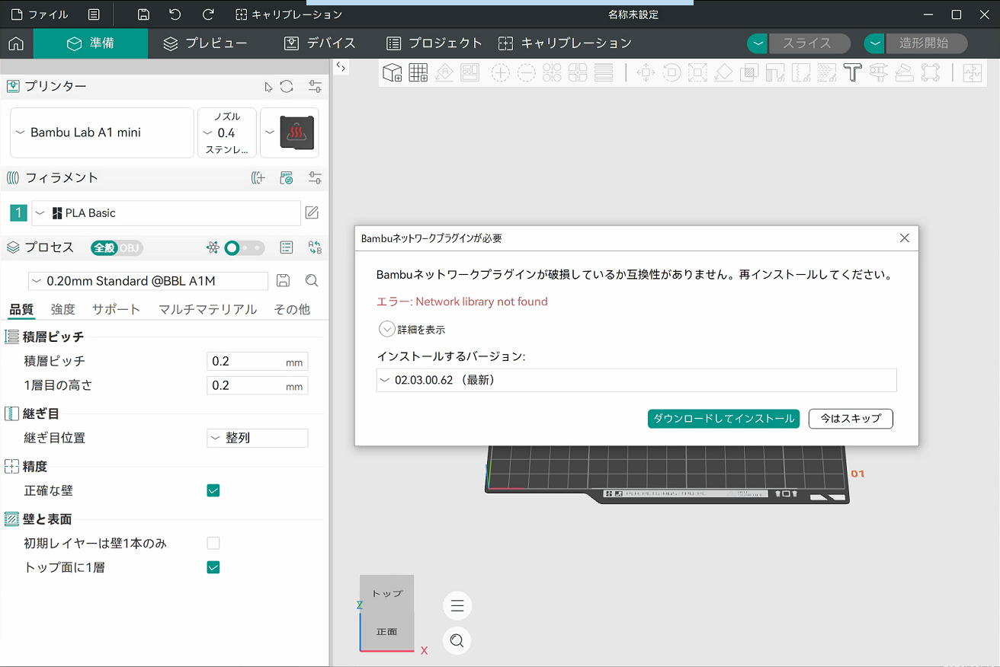

[導入・LANモード運用ガイドへ戻る](index.md)

[初年度の授業実践へ](classroom-practice-2025.md) / [3Dモデリング環境の選定へ](3d-modeling-environment-selection.md)

初年度はBambu Studioを使い、中学校3年生約160人を対象に、3Dモデルの作成からA1 miniでの造形までを授業として実施しました。

次年度に向けて、更新案内と起動画面を見直したいと考えています。

1. 使う版を固定し、授業開始時に更新案内を出さないこと
2. 起動した先を作業画面にし、一般公開モデルの共有サイトを標準導線へ置かないこと

一つ目は、初年度の第2時で実際に授業が止まった問題です。Bambu Studio本体と設定データの更新案内が続けて表示され、Windowsユーザープロファイルごとに開始画面もそろわず、授業者が個別に対応しました。

二つ目のきっかけは、生徒の一言です。起動画面に並ぶ公開モデルを見て、こうつぶやきました。

> これ使えばいいじゃん。

標準スライサーに必要なのは、3Dモデルを造形用の指令データ（G-code）へ変換する機能だけではありません。

- 全員が同じ画面から始められる
- 生徒へ管理者権限を要求しない
- クラウドアカウントを必須にしない
- 授業と関係のない外部コンテンツへ偶発的に移動しにくい
- 機種、ノズル、材料、送信先を利用者が確認できる
- 更新後に再検証できる
- 問題が起きたときに元の環境へ戻せる
- 多数のWindowsユーザーへ、認証情報を含めずに同じ初期状態を用意できる

これらを満たす次期候補として、OrcaSlicerを検証しています。

本記事は、2026年9月15日時点で検証中の環境を記録したものです。Bambu Studioを残したままOrcaSlicerを追加し、学校で使うための初期設定と接続方法を確かめています。標準スライサーの切り替えは、まだ完了していません。

## 現在の検証状況

この記事では、Windowsのアカウントを2種類使い分けます。呼び分けは権限に合わせています。

- **管理者ユーザー**：ソフトの導入と設定づくりに使う、管理者権限のあるアカウント
- **標準ユーザー**：生徒と同じ条件をつくるための、管理者権限を持たないアカウント

代表PCの管理者ユーザーでは、校内LAN経由の造形まで確認しました。標準ユーザーでも、共通の設定と通信用プラグインを用意し、初回起動からLAN接続、PC再起動後の再接続まで確認できています。

| 段階 | 確認した範囲 | 状態 |
|---|---|---|
| 代表Windows PC・管理者ユーザー | 固定した版の導入、設定、スライス、送信、校内LAN経由の造形 | 確認済み |
| 同じPCの標準ユーザー | 共通の設定だけを事前配置し、初回セットアップ画面を回避 | 確認済み |
| 同じ標準ユーザーへのプラグイン追加 | プラグインの7ファイルを配置し、認識とA1 miniへのLAN接続を確認 | 確認済み |
| 接続後の状態保持 | Windows再ログイン、PC再起動後の再接続と実機状態取得 | 確認済み |
| 配布候補ファイルの同一性 | インストーラー、共通の設定、7ファイルの計9件を照合値で確認 | 一致 |
| 複数PC・複数ユーザーへの一括展開 | 展開と復旧を含む運用 | 未実施 |
| 授業実践 | 1クラス以上での利用 | 未実施 |

標準ユーザーで行ったのは、設定ファイルだけで一度起動し、同じユーザーへ7ファイルを追加する段階試験です。設定と7ファイルを初回起動前にまとめて置く方法は、この試験に含めていません。教育的効果も、この受入試験だけでは評価しません。

## 目次

1. [この記事の対象と位置付け](#position)
2. [移行で解決したい問題](#problems)
3. [一般公開モデル探索を標準導線に含めない](#model-platform)
4. [Bambu Studioを復旧先として残す](#rollback)
5. [検証するバージョンを固定する](#version-authority)
6. [初回セットアップ画面を生徒に操作させない](#first-run)
7. [学校用の初期状態](#classroom-default)
8. [通信プラグインを本体と別に管理する](#network-plugin)
9. [ステルスモードでA1 miniへLAN接続する](#lan-connection)
10. [スライスから造形までを確認する](#slice-send)
11. [設定ファイルをそのまま配布しない](#config-security)
12. [共通設定マスターの作り方と検証](#golden-config)
13. [多数PC・多数ユーザーへの展開計画](#deployment)
14. [更新とオフライン動作の確認](#update-offline)
15. [既存教材とスライス条件の比較](#compatibility)
16. [移行を決める条件と、見送る条件](#decision)
17. [現在の判断](#current-decision)
18. [関連リンク](#related-links)

<a id="position"></a>
## 1. この記事の対象と位置付け

対象は、Bambu Lab A1 miniを学校や研修施設で共用し、Windows PCからLANモードで使用する環境です。

本記事でいう受入試験とは、導入してよいかを判断するために、必要な条件を一つずつ確かめる試験のことです。合格すれば標準環境を切り替え、満たせない条件が残れば見送ります。

[導入・LANモード運用ガイド](index.md)は、初年度にBambu Studioを使って環境を立ち上げた記録です。[初年度の授業実践](classroom-practice-2025.md)は、その環境で約160人が卒業記念プレートを製作した記録です。

本記事は、その二つの記録を上書きしません。CADの選定と作品の保存・回収については、[3Dモデリング環境の選定記事](3d-modeling-environment-selection.md)で扱います。ここでは、その後のスライス、プリンタ接続、利用者ごとの設定に範囲を絞ります。

```text
2025年度の実施記録
  Bambu Studioで授業を行った事実を保持
        ↓
2026年度以降の改善
  OrcaSlicerを次期標準候補として受入試験
```

初年度にBambu Studioを選んだことが誤りだった、という整理ではありません。当時の日本語対応、機種対応、授業準備期間を踏まえた選定です。

今回の目的は、初年度に観察した停止要因を減らし、同じ環境を多数ユーザーへ再現しやすくすることです。

公開記事であるため、学校名、PC名、内部ドメイン、実際のIPアドレス、SSID、アクセスコード、プリンタ固有IDは記載しません。

### 検証を急ぐ理由

次期学習指導要領の改訂に向けた議論が進んでいます。本記事で参照するのは、文部科学省の[「情報・技術WG 取りまとめ（案）」](https://www.mext.go.jp/content/20260804-mxt_kyoiku01-000051433-1.pdf)です。以下のページ番号は、資料に印刷された番号に従います。PDFビューア上のページ位置は、それぞれ一つ後です。

案では、中学校の「情報・技術科」を「情報技術」と「情報を基盤とした生産技術」の二つの領域に整理する方向が示されています（18ページ）。後者の内容項目案「材料加工とデジタル製作」にはCADの操作が置かれ、3D CADで設計した部品を3Dプリンタで具現化することも具体例に挙げられています（41ページ、25ページ）。教育内容の側は、[学校の3Dモデリング環境をどう選ぶか](3d-modeling-environment-selection.md)で詳しく扱いました。本記事では、それを支える条件整備の側を見ます。

条件整備としては、次が挙げられています。

- 3Dプリンター等の教材について、各自治体の整備状況を把握・可視化し、その整備促進を図ること（53ページ）
- 3Dプリンター等を含む学習環境の整備策の検討、いわゆるPC教室の環境維持に向けた周知・啓発、活用可能な財政措置等に係る整理（98ページ）
- 全ての小・中・高等学校担当教員の指導力向上に向けた大規模な研修の展開、教育委員会への伴走支援（98ページ）

また同資料は、教材の開発にとどまらず、指導計画や授業の具体的なイメージを示す参考資料と、研修を組み合わせたパッケージの提供まで行うべきだと述べています（53ページ）。

時期も示されています。中学校の次期学習指導要領は、令和13年度から全面実施とされています（101ページ）。いわゆるPC教室の在り方は、学校のICT環境整備3か年計画（令和7〜9年度）の期間中に整理するとされています。3Dプリンター等の教材整備の促進策も、同じ時期に検討する計画です（103ページ、108ページ）。環境をどう整えるかを決める時期が、いま動いています。

いずれもまだ案の段階です。特定の機種や台数、PC教室の仕様を決めたものではありません。読み取れるのは、機器の整備だけを条件整備として扱ってはいない、ということです。

ここから先は、私の見立てです。取りまとめ案が示すのは、教育課程と条件整備の方向です。実際の学校では、その間にもう一段の条件があります。

```text
モデリング
  ↓
保存とファイルの受け渡し
  ↓
スライス
  ↓
機種・材料・送信先の設定
  ↓
プリンタへ接続
  ↓
造形
  ↓
失敗したときの復旧
  ↓
年度をまたぐ設定と版の管理
```

本事例では、GIGAスクール構想で整備された1人1台端末だけで、この流れは完結しませんでした。A1 miniを使う構成では、スライサーを動かし、周辺機器を管理できるPC環境まで含めて設計する必要がありました。機種や構成が変われば結論も変わります。ここで書けるのは、本事例の観察範囲です。

公費で導入する以上、納品の日を導入の完了日にしたくありません。使われない3Dプリンタからは、フィラメントの注文も来ません。使われて、送りネジやベルトが摩耗するくらい回って、はじめてその支出は生きます。

そのためには、教員と教育行政の側が自分で評価できる状態でいることが要ります。この記事は、そのための手順と判断基準を、自分の環境で一つずつ確かめた記録です。

<a id="problems"></a>
## 2. 移行で解決したい問題

### 理由1：更新案内で授業開始が止まる

初年度の第2時では、Bambu Studio本体と設定データの更新案内が続けて表示されました。

一斉授業では、更新するのか、閉じるのか、教員を呼ぶのかを生徒が判断できません。数十台の開始画面がそろわないだけで、その後の説明へ進めなくなります。

取りまとめ案は、「技術の統合」について、構想、制作・実装、評価・改善を繰り返しながら学べるよう、一定のまとまりのある時間を確保することが適当だとしています（53ページ）。

授業時間は伸ばせません。開始時に止まった分は、その繰り返しへ充てるはずだった時間から引かれます。

OrcaSlicerでは、検証する版のWindows用インストーラーを取得し、その照合値を記録して固定しました。照合値については[第5節](#version-authority)で説明します。

ただし、次は同じではありません。

```text
導入するアプリ本体の版を固定する
≠
更新通知が一切表示されない
```

OrcaSlicer本体、システムプリセット（機種や材料の標準設定）、Bambu Network plug-in（通信用プラグイン）は、それぞれ別に更新されます。更新の挙動は3つとも分けて確認する必要があります。

### 理由2：起動画面が、授業と別の選択肢を先に見せる

初年度の授業では、生徒自身がTinkercadで作成した3DモデルをSTLとして書き出し、スライサーで検査しました。

初年度に使ったBambu Studioでは、起動時にモデル共有サイトのMakerWorldが表示されました。「自分で設計し、スライス結果を見て修正する」という授業の経路とは別の選択肢が、最初の画面から提示されます。

冒頭の「これ使えばいいじゃん」は、その状態を言い当てた発言でした。完成品が並んでいれば、そちらが早い。生徒の判断としては当然です。だからこそ、最初の画面が何を見せるかまでが授業の設計です。

OrcaSlicerでは、起動直後のページを「準備」にし、ログイン用サイドパネルを隠す設定を確認しました。標準経路を、STLの読込みとスライスから始められます。

### 利用者ごとの初期状態をそろえる

Bambu StudioもOrcaSlicerも、設定の多くをWindowsユーザープロファイルに保存します。

1台のPCへアプリをインストールできても、そのPCを使うすべての生徒が同じ状態で起動できるとは限りません。

確認単位は、PCだけではありません。

```text
Windows PC
＋
Windowsユーザープロファイル
```

授業前に管理側でそろえる必要があるのは、次です。

- 初回セットアップ
- 使用機種
- 材料
- プロセス
- 開始ページ
- クラウド関連表示

<a id="model-platform"></a>
## 3. 一般公開モデル探索を標準導線に含めない

MakerWorldには、公開モデルを探し、共有し、造形するための価値があります。その機能自体を否定するものではありません。私自身、家庭でアクセサリを造形するときに使っています。

分けたいのは、個人の利用と、学校の標準導線です。学校の標準授業導線へ一般公開モデル探索を組み込むと、少なくとも次の確認が必要になります。

- 授業目的に合うモデルか
- 安全上、生活指導上の問題がないか
- 武器を模した形状など、学校での扱いに慎重な判断が必要なものではないか
- 著作権、商標、ライセンス条件を満たすか
- 既存モデルの取得が、生徒自身の設計活動を置き換えていないか

最後の一つを、私はいちばん気にしています。授業の入口で既存モデルが前面に出ると、自分で構想して形にする前に、そこから選ぶ方向へ意識が向くのではないか。設計を学ぶ授業で、その入口を最初に見せるかどうかは、教員が決めることです。

そのため、本実践では次を標準入力とします。

```text
生徒自身が作成したモデル
または
教員が事前確認したテンプレート
```

一般公開モデルを教材にする場合は、教員が内容と利用条件を確認した上で、別の授業活動として扱います。

なお、OrcaSlicerにもOrca Cloudや共有プロファイルへの導線があります。OrcaSlicerへ替えるだけで外部導線がすべて消えるわけではありません。

本検証では、次の設定までを一組として扱います。

- ステルスモードを有効にする
- 起動ページを「準備」にする
- ログイン用サイドパネルを隠す
- Bambu Cloudを使用しない
- 共有プロファイル通知を無効にする

これは機能を全面禁止する設計ではなく、授業時の標準導線を限定する設計です。

<a id="rollback"></a>
## 4. Bambu Studioを復旧先として残す

OrcaSlicerを導入する前に、既存Bambu Studioの動作を確認しました。

確認したのは次です。

- 既存版のBambu Studioが通常ユーザーで起動する
- 更新案内をキャンセルし、既存版を維持できる
- A1 miniへLANモードで接続できる
- 表示された送信先と実機を照合できる
- プリンタの再登録を要求されない
- ファームウェアやLAN設定の変更を要求されない

更新案内は表示されましたが、自動更新は始まりませんでした。

検証中はBambu Studioをアンインストールしません。OrcaSlicer側で問題が起きた場合は、既知良好なBambu Studioへ戻せる状態を保持します。

```text
OrcaSlicerを追加
  ↓
比較・検証
  ↓
問題があればBambu Studioへ戻る
```

標準スライサーを変更するのは、代表PCでOrcaSlicerが起動した時点ではありません。多数ユーザーへ同じ状態を再現し、復旧できることを確認した後です。

<a id="version-authority"></a>
## 5. 検証するバージョンを固定する

学校の代表Windows PCでは、OrcaSlicer `v2.4.2`の64ビット版インストーラーを使用しました。

対象ファイルは次です。

```text
OrcaSlicer_Windows_Installer_V2.4.2_x64.exe
```

取得したファイルが目的のものと同じかどうかは、ファイルの中身から計算する値で確かめられます。同じファイルなら同じ値になり、1バイトでも違えば別の値になります。ここではSHA-256という方式の値を使い、以下これを照合値と呼びます。

本検証で記録した照合値は次です。

```text
F602F9D646F49BEE387D8F342A0193A7EF20756EABB845E19795C5A62B90A58A
```

検証したPCではWinGetを利用できなかったため、公式の配布ページから取得したインストーラーを使いました。インストール先は`C:\Program Files\OrcaSlicer`で、通常ユーザーから起動できました。

実行ファイルの`FileVersion`と`ProductVersion`は空欄でした。調べた64ビット側のアンインストール情報でも、該当する登録は見つかりませんでした。これは、他の保存先や確認方法でも版を取得できないという意味ではありません。

本検証では、導入元を特定する記録として次を残しました。

```text
公式の配布ページ
＋
インストーラーの正確なファイル名
＋
照合値（SHA-256）
＋
インストール後の実行ファイル存在
```

照合値が一致しても、確かめられるのは「同じファイルである」ことだけです。取得元が信頼できることも、導入先で正常に動くことも、この値からは分かりません。導入元の記録と、起動・接続の試験結果を組み合わせて扱います。

### 更新は保守する時期を決めて行う

版を固定するのは、授業期間中に画面や動作が変わるのを避けるためです。更新候補の確認と受入試験は、長期休業などの保守期間に行います。

取りまとめ案では、個別の機器やソフトウェアの知識を網羅するより、問題解決に必要な考え方や方法を重視し、教材等と連携して学習内容を柔軟に更新する方向が示されています（57ページ）。本事例では、授業期間中の安定と更新の機会を両立させるため、更新を確かめる場所と時期を決めます。重大な不具合や脆弱性への対応が必要になった場合は、定期の保守期間を待たず、利用停止や更新を判断します。

なお、取りまとめ案が特定のスライサーや版の固定方式を求めているわけではありません。ここで書く版の固定、保守期間、受入試験は、本事例の運用から導いた判断です。

<a id="first-run"></a>
## 6. 初回セットアップ画面を生徒に操作させない

OrcaSlicerを新しいユーザーで初めて起動すると、地域やプリンタを順に選ぶ画面が出ます。ここではこれを初回セットアップ画面と呼びます（英語表記はWizard）。`v2.4.2`のこの画面には、通常画面より英語表示が多く残っていました。



代表PCの管理者ユーザーでは、地域にAsia-Pacific、プリンタにBambu Lab A1 mini、材料にBambu PLA Basicを選びました。ステルスモードを有効にし、Bambu Network plug-inを導入しています。



教員が一度操作できても、40人が同じ手順を誤りなく進められるとは限りません。生徒が作業を始める前の設定は、管理側で用意する方針です。

Bambu A1 mini用の設定ファイルで、この方針を試しました。使ったのは、OrcaSlicerの設定フォルダーがまだ作られておらず、管理者グループにも属していない標準ユーザーです。そこへ設定ファイル`OrcaSlicer.conf`だけを置きました。

初回セットアップは表示されず、日本語の［準備］画面が開きました。A1 mini、0.4 mmノズル、Bambu PLA Basic、標準プロセスも再現できています。

ただし、この時点では通信用プラグインの本体を置いていないため、「Bambuネットワークプラグインが必要」という案内が出ました（画面のエラー表示は`Network library not found`）。初期設定の再現と、通信機能の準備は別の工程です。

<a id="classroom-default"></a>
## 7. 学校用の初期状態

共通にしたい初期状態を1つの設定ファイルにまとめ、標準ユーザーで確認しました。以下では、この配布用のファイルを共通設定マスターと呼びます。

| 項目 | 採用候補 | 確認状態 |
|---|---|---|
| OrcaSlicer | `2.4.2` | 固定したインストーラーを使用 |
| 表示言語 | 日本語 | 別ユーザーで再現 |
| 操作モード | Simple | 起動後の設定で確認 |
| 起動ページ | 準備 | 別ユーザーで再現 |
| ステルスモード | ON | 起動後の設定で確認 |
| ログイン用サイドパネル | 非表示 | 別ユーザーで再現 |
| クラウドアカウント | ログインしない | 未ログインでLAN接続 |
| システムプリセット自動更新 | OFF | 起動後の設定で確認 |
| 共有プロファイル通知 | OFF | 共通設定マスターへ反映し、起動後の設定でも維持 |
| プリンタ | Bambu Lab A1 mini | 別ユーザーで再現 |
| 選択中のノズル | 0.4 mm | 別ユーザーで再現 |
| フィラメント | Bambu PLA Basic | 別ユーザーで再現 |
| プロセス | `0.20mm Standard @BBL A1M` | 別ユーザーで再現 |



［設定］→［オンライン］画面には、日本語化されていない項目があります。上の表の呼び方と、画面の表示は次のように対応します。

| 表での呼び方 | 画面の表示 |
|---|---|
| ステルスモード | ステルスモード |
| ログイン用サイドパネル | `Hide login side panel` |
| クラウドアカウント | `Enable Bambu Cloud` |
| システムプリセット自動更新 | `Update built-in presets automatically.` |

`0.20mm Standard`は、動作を比較する基準として使った設定です。初年度に通常使用した`0.28 mm Extra Draft`との造形時間・品質比較は、まだ行っていません。0.4 mmが初期選択されることと、他のノズル径を選べないよう制限することも別で、後者は行っていません。

`Enable Bambu Cloud`は灰色で操作できない状態でしたが、チェック自体は付いたままでした。この状態を「チェックがOFF」とは記録しません。確認できたのは、ステルスモードがONで、クラウドへログインせずにLAN接続できたことです。外部通信が一切発生しないことまでは調べていません。

<a id="network-plugin"></a>
## 8. 通信プラグインを本体と別に管理する

A1 miniとの通信には、Bambu Network plug-in（ネットワークプラグイン）を使用しました。OrcaSlicer本体とは別に配布される通信用の部品です。今回確認した版は`v02.03.00.62`です。



OrcaSlicer本体は`C:\Program Files\OrcaSlicer`に置かれていますが、今回のプラグイン本体は、利用者ごとの設定が入るフォルダー（`%APPDATA%`）の下に保存されていました。

```text
%APPDATA%\OrcaSlicer\plugins\
```

このフォルダーには、拡張子が`.dll`のファイルが7個入っていました。DLLは、アプリが起動時や必要時に読み込んで使う部品ファイルです。以下ではまとめて「7ファイル」と呼びます。

```text
agora_rtc_sdk.dll
BambuSource.dll
bambu_networking_02.03.00.62.dll
libagora-core.dll
libagora-ffmpeg.dll
libagora-soundtouch.dll
live555.dll
```

管理者ユーザーには`plugins\backup\`もありましたが、標準ユーザーへは`plugins\`直下の7ファイルだけを置きました。欠落の案内は消え、［デバイス］画面の左下に`ネットワークプラグイン v02.03.00.62`と表示されました。その後のLAN接続と、PC再起動後の再接続も成立しています。

配布元と配布先で7ファイルの照合値を比べ、全件が一致しました。

ここで確認できたのは、**この7ファイルを含む構成で、今回の起動・接続試験が成立したこと**です。1つずつ省く試験は行っていないため、7個すべてが必須の最小構成だとは断定しません。また、`backup`を配布せずに起動できたことを、将来の更新・障害復旧でも不要という意味には広げません。

本体、通信プラグイン、プリセットは分けて管理します。いずれかが変わったときは、検証した組み合わせと同じかを確認し直します。

<a id="lan-connection"></a>
## 9. ステルスモードでA1 miniへLAN接続する

ステルスモードを有効にした状態で、［デバイス］から［アクセスコードと紐付け］を選びました。A1 mini本体で現在のIPアドレスとアクセスコードを確認し、接続画面へ直接入力する方法です。



管理者ユーザーと、共通設定マスターから起動した標準ユーザーの両方で、クラウドログインやステルスモードの解除を求められずに接続できました。接続後は、ノズルとベッドの温度などの実機情報が表示されます。



標準ユーザーでは、Windowsからのログオフ・再ログイン、PC再起動を経ても登録情報が保たれ、IPアドレスやアクセスコードを入力し直さずに状態を取得できました。



これは日常操作を減らせる一方、接続情報が保存されることも意味します。認証情報を共通設定へ含めないことと、接続後にも端末へ保存させないことは別です。保存後の扱いは[設定ファイルの管理](#config-security)に記載します。

なお、この試験はインターネットを遮断した条件ではありません。クラウド未ログインで接続できたことと、インターネットなしで全工程が成立することは分けて確認します。

<a id="slice-send"></a>
## 10. スライスから造形までの確認

既知のSTLを読み込み、次の条件でスライスしました。

```text
Printer   Bambu Lab A1 mini
Nozzle    0.4 mm
Filament  Bambu PLA Basic
Process   0.20mm Standard @BBL A1M
```

結果は次でした。

```text
レイヤー数        140
高さ              28.00 mm
フィラメント長    11.56 m
フィラメント重量  35.05 g
プレビューの推定時間  約1時間12分
送信直前画面の推定    約1時間14分
```

これらは一つのモデルと設定に対する推定値です。実測の造形時間ではありません。プレビューと送信直前画面で時間表示に差があるため、画面ごとの値として記録しています。



送信直前画面では、次を確認できました。

- モデル名とプレビュー
- 推定時間
- 材料使用量
- 送信先A1 mini
- A1 miniの0.4 mmノズル
- 外部スプールのPLA
- タイムラプス
- 自動ベッドレベリング
- フローダイナミクスキャリブレーション
- 明示的な送信ボタン



学校の代表PCの管理者ユーザーから送信し、校内LAN経由でA1 miniが造形するところまで確認しました。

標準ユーザーで確認したのは、初期状態の再現、LAN接続、再起動後の状態保持までです。このユーザーからの実送信・実造形は、まだ行っていません。管理者ユーザーでの造形結果とは、確認した範囲を分けて記録します。

<a id="config-security"></a>
## 11. 設定ファイルをそのまま配布しない

OrcaSlicerの主要設定は、Windowsでは次に保存されました。

```text
%APPDATA%\OrcaSlicer\OrcaSlicer.conf
```

このファイルには、初回セットアップの完了状態、日本語、起動ページ、機種、材料など、共通にしたい設定が含まれます。同時に、最近使ったフォルダー、ユーザー固有の保存先、接続先の情報も入ります。

実機へ接続した後の設定ファイルには、接続先の機器の識別情報やIPアドレス、LANのアクセスコードが書き込まれていました。設定ファイル内での項目名は`local_machines`と`user_access_code`です。アクセスコードは暗号化されず、そのまま読み取れる状態でした。

したがって、接続済みユーザーの設定ファイルを、そのまま配布用マスターへ戻してはいけません。共通設定と、利用中に各ユーザーで生成された情報を分けて管理します。

| 管理するもの | 扱い |
|---|---|
| 共通設定マスター | 認証情報、利用者ごとの保存先、履歴、機器の識別情報を除いた配布用のファイル |
| 起動後のユーザー設定 | 各ユーザーの保存先や識別値が生成される。マスターとは別物 |
| 接続後のユーザー設定 | 接続先とアクセスコードを含む。閲覧・保管できる範囲を限定する |
| 公開資料・授業資料 | 実値を載せず、必要な図版は匿名化する |

共通設定マスターに認証情報を含めなくても、一度接続すれば、そのユーザーの設定には保存されます。今回、再ログインやPC再起動後に入力し直さず接続できたのも、この状態保持と整合します。「毎回アクセスコードの入力が必須になる仕組み」を作れたわけではありません。

接続後の設定ファイルを共有フォルダーへ置いたり、調べるために外部のAIサービスへそのまま貼り付けたりすることは避けます。確認結果を共有するときは、設定項目の有無、照合の成否、匿名化した画面を使います。

<a id="golden-config"></a>
## 12. 共通設定マスターの作り方と検証

管理者ユーザーの設定ファイルを基に、学校で共通にしたい項目だけを残した配布用のファイルを作りました。これが共通設定マスターです（英語圏の資料では Golden Config や golden image と呼ばれます）。続いて、OrcaSlicerの設定フォルダーをまだ持たない標準ユーザーで動作を確かめました。

### 共通にしたい設定を残し、その利用者だけの情報を除く

主に残した設定は次です。

```text
初回セットアップ完了
日本語 / Simple mode / 準備画面で起動
ステルスモード ON / ログイン用サイドパネル非表示
システムプリセット自動更新 OFF
共有プロファイル通知 OFF
A1 mini / 0.4 mm / Bambu PLA Basic
0.20mm Standard @BBL A1M
プラグイン有効 / v02.03.00.62
```

削除した項目は次です。

```text
app.slicer_uuid
app.download_path
app.last_backup_path
app.window_layout
app.window_mainframe
recent
local_machines
user_access_code
```

共有プロファイル通知は、元の設定では有効でした。共通設定マスターでは`show_shared_profiles_notification=false`へ変更し、起動後もその値が保たれることを確認しました。

この設定ファイルの末尾には、中身が壊れていないかをアプリ自身が確かめるための値（MD5）が書かれています。項目を編集したときは、この値も書き直さないと読み込まれません。配布するファイルの同一性を確かめる照合値とは、目的も対象も別です。

### 第1段階：設定ファイルだけを配置する

置いたのは`OrcaSlicer.conf`だけです。プラグインや、管理者ユーザーのその他のフォルダーは持ち込みませんでした。

初回セットアップ画面は出ず、［準備］画面が開きました。A1 mini、0.4 mm、PLA Basic、標準プロセスも再現できています。プラグインの本体がないため、「Bambuネットワークプラグインが必要」という案内が表示されました。



ここでは［ダウンロードしてインストール］を押さず、［今はスキップ］で終了しました。終了後の設定ファイルには、このユーザー用の識別子、ダウンロード先、一時バックアップ先が作られていました。接続先とアクセスコードの項目は、まだありません。

### 第2段階：同じユーザーへ7ファイルを追加する

次に、[第8節](#network-plugin)の7ファイルを`plugins\`へ追加しました。`plugins\backup\`と`BambuNetworkEngine.conf`はコピーしていません。

再起動すると欠落の案内は出ず、プラグイン`v02.03.00.62`が認識されました。コピーした7ファイルは、配布元と配布先ですべて照合値が一致しています。

### 第3段階：接続と保持を確認する

A1 miniへLAN接続し、実機状態を取得できました。Windows再ログインとPC再起動後も再接続できています。

この過程で生成された情報は、次のように分けて記録しました。

| 情報・ファイル | 観測した状態 |
|---|---|
| 識別子、保存先、一時バックアップ先 | 共通設定マスターでは削除し、最初の起動後に対象ユーザー用の値が作られたことを確認 |
| `BambuNetworkEngine.conf` | 配布していない。プラグイン導入後、実機接続前にすでに存在 |
| `local_machines`、`user_access_code` | 最初の起動後にはなく、実機接続後に存在を確認 |
| プラグインと登録情報 | Windows再ログイン・PC再起動後も利用できた |

`BambuNetworkEngine.conf`を「実機接続によって生成されたファイル」とは扱いません。接続前から存在しており、どの処理の瞬間に作られたかまでは追っていないためです。

### 配布候補は設定1ファイルと7ファイル

段階試験で成立した構成は次です。

```text
PC全体
└─ OrcaSlicer 2.4.2

各Windowsユーザー
└─ AppData\Roaming\OrcaSlicer\
   ├─ OrcaSlicer.conf    ← 共通設定マスター
   └─ plugins\
      └─ 通信プラグインの7ファイル
```

`plugins\backup\`、`BambuNetworkEngine.conf`、ログ、履歴、接続先、アクセスコードは、初期配布セットへ含めませんでした。初回起動時にはプリンタ定義や設定用のフォルダーも生成されましたが、それらをインターネットなしで再生成できるかは未確認です。

インストーラー、共通設定マスター、通信プラグインの7ファイル。この計9件を一つの配布候補としてまとめ、それぞれの照合値を記録しました。現在の記録は[配布候補9ファイルの照合値一覧](assets/manifests/orcaslicer-2.4.2-a1mini-20260915.sha256)に掲載しています。ファイル本体と、接続済みの設定ファイルは掲載していません。

この構成での再現を確認したのは、設定だけで起動した後にDLLを追加した場合です。初回起動前に両方を同時配置する方法の確認とは区別しています。

<a id="deployment"></a>
## 13. 多数PC・多数ユーザーへの展開計画

代表PCでは、標準ユーザーへ共通の設定とプラグインを用意し、初回セットアップ画面の回避、LAN接続、再ログイン・再起動後の再接続まで確認しました。多数のPCへ一括展開した結果ではありません。

今後は、学校の端末管理方法に合わせて、利用するPCとユーザーを段階的に増やします。初期状態の再現に加え、授業での使いやすさと、問題が起きたときに復旧できるかを確かめます。

同じ担当教員が毎年ひとりで設定を配り直す運用にはしない方針です。管理側が端末・ネットワーク・展開・復旧を担い、授業側が必要な機能と標準設定を判断するなど、権限と作業時間を含めて分担を決めます。

<a id="update-offline"></a>
## 14. 更新とオフライン動作の確認

複数回の起動、Windows再ログイン、PC再起動を経ても、共通の設定とプラグインは保たれ、A1 miniへ再接続できました。7ファイルを配置した後の起動では、プラグイン欠落の案内も出ていません。

ただし、将来の更新案内を抑止できるか、インターネットへ接続できない条件でも同じように使えるかは、未確認です。ステルスモードとクラウド未ログインで接続できた結果だけでは、これらを判断できません。

今後は、更新と通信環境の変化が日常利用に与える影響を確認します。生徒が授業開始時に更新・ログイン・同期の判断を求められず、作業を始められることを目指します。

<a id="compatibility"></a>
## 15. 既存教材とスライス条件の比較

初年度は通常のスライス設定として`0.28 mm Extra Draft`を使いました。今回のOrcaSlicer受入試験では、`0.20mm Standard @BBL A1M`を動作確認の基準にしています。両者の造形時間と品質は、まだ比較していません。

ビルドプレートの指定も、授業用設定とは分けて扱います。初年度はBambu Textured PEI Plateを使いましたが、今回の準備画面にはSmooth PEI Plate / High Temp Plateの表示があります。今回の初期状態を、そのまま授業用の完成設定とはしていません。

今後は、これまでの教材を使い、授業に必要な造形時間と品質を満たす設定を検討します。既存の3MFについても、形状や配置を再利用できるかを確認します。旧G-codeをそのまま流用せず、使用する実機と材料に合う条件で再スライスする方針です。

<a id="decision"></a>
## 16. 移行を決める条件と、見送る条件

標準ユーザーでの初期状態の再現、プラグインの認識、LAN接続、再起動後の再接続は確認できました。配布候補9件の照合も済み、次の展開検証へ進める段階です。

標準スライサーの切り替えは、複数の端末と利用者で安定して使え、授業に必要な時間・品質・安全性を確保できるかで判断します。設定の保管、復旧、更新を、担当者が代わっても続けられることも条件です。

これらを満たせない場合は、切り替えを保留します。授業を継続できるよう、検証中は既知良好なBambu Studioを残します。

<a id="current-decision"></a>
## 17. 現在の判断

2026年9月15日時点では、配布候補を用意し、別ユーザーでの起動・LAN接続・状態保持を確認できた段階です。

| 対象 | 判断 |
|---|---|
| 管理者ユーザーでのスライス・校内LAN経由の造形 | 確認済み |
| 共通設定マスターによる初回セットアップ画面の回避 | 標準ユーザーで確認済み |
| 通信プラグイン7ファイルの追加、認識、LAN接続 | 標準ユーザーで確認済み |
| Windows再ログイン・PC再起動後の再接続 | 確認済み |
| 配布候補9件の照合値 | 一致 |
| 複数台への展開と授業運用 | 検証を継続する |
| 標準スライサーの一斉変更 | 保留 |
| Bambu Studioの削除 | 行わない |

共通の設定を移し、通信用のファイルを追加することで、管理者ユーザーとは別の標準ユーザーでもLAN接続を再現できました。今後は対象を広げ、日常の授業で無理なく使い続けられるかを確かめます。

目指しているのは、生徒が同じ画面から始め、設計とスライス結果の確認に時間を使える環境です。問題が起きても作業へ戻れる見通しが立つまでは、Bambu Studioを復旧先として残します。

<a id="related-links"></a>
## 18. 関連リンク

- [導入・LANモード運用ガイド](index.md)
- [中学校3年生160人規模で卒業記念プレートを3Dプリントした初年度実践](classroom-practice-2025.md)
- [学校の3Dモデリング環境をどう選ぶか](3d-modeling-environment-selection.md)
- [参考資料](references.md)
- [情報・技術ワーキンググループ（文部科学省 中央教育審議会 初等中等教育分科会 教育課程部会）](https://www.mext.go.jp/b_menu/shingi/chukyo/chukyo3/118/index.html)
- [同ワーキンググループ 取りまとめ案（PDF）](https://www.mext.go.jp/content/20260804-mxt_kyoiku01-000051433-1.pdf)
- [OrcaSlicer公式リポジトリ](https://github.com/OrcaSlicer/OrcaSlicer)
- [OrcaSlicer v2.4.2 Release](https://github.com/OrcaSlicer/OrcaSlicer/releases/tag/v2.4.2)
- [GitHubリポジトリ](https://github.com/Yuichiroh-Kobayashi/bambu-a1-school-lan-guide)
